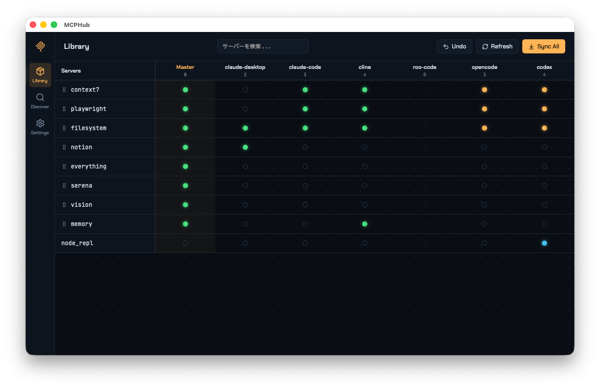

# MCPHub

[](LICENSE)
[](https://github.com/shunilab/mcp-hub/releases)



MCP (Model Context Protocol) サーバー設定を複数の AI クライアント間で一元管理するデスクトップアプリ + CLI ツール。

## 概要

MCPHub は **マスター設定** (`~/.mcp-hub/servers.json`) を中心に、各クライアントの設定ファイルへ双方向に同期します。GUI では「サーバー × クライアント」のマトリクス上でクリックひとつで配布・解除でき、CLI でスクリプトからも利用できます。

## 対応クライアント

| クライアント | macOS | Windows |
|---|---|---|
| Claude Desktop | `~/Library/Application Support/Claude/claude_desktop_config.json` | `%APPDATA%\Claude\claude_desktop_config.json` |
| Claude Code | `~/.claude.json` | `%USERPROFILE%\.claude.json` |
| Cline | `~/Library/Application Support/Code/User/globalStorage/saoudrizwan.claude-dev/settings/cline_mcp_settings.json` | `%APPDATA%\Code\User\globalStorage\saoudrizwan.claude-dev\settings\cline_mcp_settings.json` |
| Roo Code | `~/Library/Application Support/Code/User/globalStorage/rooveterinaryinc.roo-cline/settings/mcp_settings.json` | `%APPDATA%\Code\User\globalStorage\rooveterinaryinc.roo-cline\settings\mcp_settings.json` |
| OpenCode | `~/.config/opencode/opencode.json` | `%APPDATA%/opencode/opencode.json` |
| Codex | `~/.codex/config.toml` | `%USERPROFILE%/.codex/config.toml` |

## インストール

### macOS

#### GUI（デスクトップアプリ）

1. [Releases](https://github.com/shunilab/mcp-hub/releases) から `MCPHub_x.x.x_universal.dmg` をダウンロード
2. DMG をダブルクリックしてマウント → `MCPHub.app` を `/Applications` にドラッグ
3. 初回起動時に Gatekeeper の警告が出る場合は、`右クリック → 開く` を選択

#### CLI

GUI アプリを起動後、**Settings → Install CLI to PATH** をクリック。その後シェルを再起動して確認:

```bash
mcp-hub --help
```

---

### Windows

#### GUI（デスクトップアプリ）

1. [Releases](https://github.com/shunilab/mcp-hub/releases) から `MCPHub_x.x.x_x64-setup.exe` をダウンロード
2. インストーラーをダブルクリックして実行
3. SmartScreen の警告が出た場合は「詳細情報 → 実行」を選択

#### CLI

GUI アプリを起動後、**Settings → Install CLI to PATH** をクリック。コマンドプロンプト / PowerShell を再起動して確認:

```cmd
mcp-hub --help
```

## CLI 使い方

```bash
# マスターにサーバーを追加
mcp-hub add my-server --command npx --args "-y @modelcontextprotocol/server-fetch"

# マスター → 全クライアントへ同期
mcp-hub sync

# 特定クライアントへだけ同期
mcp-hub sync --to claude-desktop

# クライアントの設定をマスターに取り込む
mcp-hub import --from cline

# 全クライアントとマスターの差分を確認
mcp-hub status

# 直前の変更を元に戻す
mcp-hub undo
```

### sync コマンドのパターン

| コマンド | 動作 |
|---|---|
| `mcp-hub sync` | マスター → 全クライアント |
| `mcp-hub sync --to claude-code` | マスター → 指定クライアント |
| `mcp-hub sync --from cline --to master` | クライアント → マスター |
| `mcp-hub sync --from all` | 全クライアント → マスター |
| `mcp-hub sync --server my-server --to claude-code` | 1 サーバーだけ同期 |

## GUI の使い方

### Library ビュー

行 = サーバー、列 = **Master** + 各クライアントの同期マトリクスです。各セルの LED が状態を表します:

| LED | 状態 |
|---|---|
| 🟢 緑 | 同期済み |
| 🟠 オレンジ | ドリフト（master と定義が異なる） |
| 🔵 青 | クライアントのみに存在（master 未登録） |
| ⚪ 中空 | 未配布 |

- **セルをクリック** → 未配布なら配布、同期済みなら解除。ドリフト / クライアントのみの場合は操作メニュー（master を上書き / クライアントを上書き / 取り込み）を表示
- **行をクリック** → Inspector パネルを開き、master 定義の JSON 編集・クライアントごとの配布状況・ドリフト差分の確認ができる
- 行左端のハンドル (⠿) をドラッグしてサーバーの並び替え
- 右クリックで行 / 列 / セルごとのコンテキストメニュー
- 上部の **Sync All** で master → 全クライアントへ一括同期、検索ボックスでサーバーを絞り込み
- **Cmd+Z**: undo、**Cmd+R**: 再読み込み、**Esc**: Inspector を閉じる

### Discover ビュー

公式 MCP サーバーリポジトリと Smithery レジストリからサーバーを検索し、ワンクリックでマスターに追加できます。

### Settings ビュー

- CLI の PATH へのインストール / アンインストール
- 各クライアントの設定ファイルパスを上書き
- カスタムクライアントの追加 / 削除（`~/.mcp-hub/clients.json` を GUI から編集）
- バックアップの保持数の設定

## 設定ファイルの形式

### servers.json（マスター設定）

`~/.mcp-hub/servers.json` がすべての設定の基点です:

```json
{
  "version": 1,
  "mcpServers": {
    "my-fetch-server": {
      "command": "npx",
      "args": ["-y", "@modelcontextprotocol/server-fetch"]
    },
    "my-remote-server": {
      "url": "https://example.com/mcp",
      "headers": { "Authorization": "Bearer TOKEN" }
    }
  }
}
```

### カスタムクライアントの追加

GUI の **Settings → Custom Clients** から追加できるほか、`~/.mcp-hub/clients.json` に直接追記することもできます:

```json
{
  "my-client": {
    "configPath": "~/path/to/config.json",
    "rootKey": "mcpServers",
    "format": "json"
  }
}
```

| フィールド | 説明 |
|---|---|
| `configPath` | 設定ファイルのパス（`~/` 展開対応。OS 別指定は `{ "darwin": "...", "win32": "..." }` 形式） |
| `rootKey` | MCP サーバー一覧が格納されているキー名（例: `"mcpServers"`） |
| `format` | ファイル形式: `"json"` / `"toml"` / `"yaml"` |

## トラブルシューティング

### `mcp-hub: command not found`

Settings → **Install CLI to PATH** を実行後、シェルを再起動してください。手動で追加する場合は `~/.mcp-hub/bin` を `PATH` に追加します。

### Tauri dev 起動時に `cli.cjs not found` エラー

CLI を先にビルドする必要があります:

```bash
pnpm --filter @mcp-hub/cli build
```

### 設定ファイルが見つからない（Cline / Roo Code）

VSCode を一度起動して対象の拡張機能をインストールすると設定ファイルが生成されます。パスは上記「対応クライアント」テーブルを参照してください。

### 変更を誤って同期してしまった

```bash
mcp-hub undo
```

変更前のバックアップから復元されます。

## 開発

**前提条件**: Node.js 20+、pnpm 11.2.2+、Rust (stable)

```bash
# 依存関係インストール
pnpm install

# CLI をビルド (Tauri dev 実行前に必須)
pnpm --filter @mcp-hub/cli build

# Tauri アプリを開発モードで起動
pnpm --filter @mcp-hub/app tauri dev
```

詳細なアーキテクチャと内部構造は [CLAUDE.md](./CLAUDE.md) を参照してください。

## ライセンス

[MIT](LICENSE)
